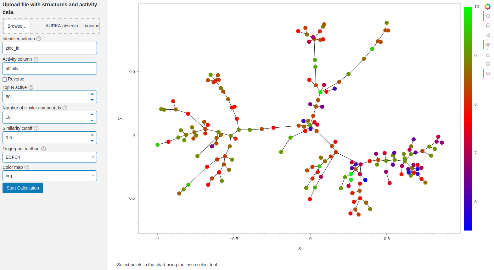
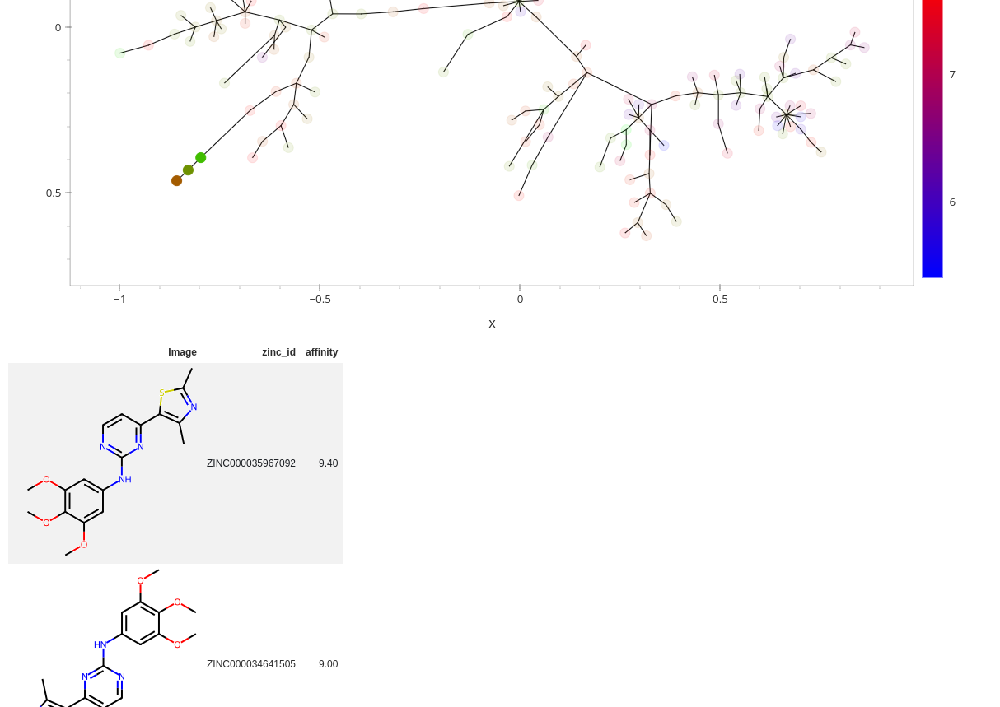

# Cluster_MST

This [Panel](https://panel.holoviz.org/) app performs a clustering of small molecules based on their structures and visualizes the results as points and connections in a [Minimum Spanning Tree](https://en.wikipedia.org/wiki/Minimum_spanning_tree) (MST), where the points can be colored according to an activity column present in the input file, e.g. from HTS results.

In addition to Panel, the main dependencies of this app are:
* [RDKit](https://www.rdkit.org/) - open source cheminformatics toolkit
* [Pandas](https://pandas.pydata.org/) - Python data analysis library
* [Networkx](https://networkx.org/documentation/stable/reference/algorithms/generated/networkx.algorithms.tree.mst.minimum_spanning_tree.html) - implementation of the MST algorithm
* [graphviz](https://github.com/xflr6/graphviz)

## Usage

The main input for the app is a tab-separated file (<*.tsv>) with at least three columns.
1. &lt;Compound identifier&gt;: A column with unique identifiers of the compounds in the file
1. &lt;Activity&gt;: A column with the activitiy for the coloring of the points. If higher values do NOT mean higher activity, check the "Reverse" checkbox.
1. "Smiles": A column with the name "Smiles" that contains the structures encoded as SMILES.

The app takes the top N active compounds ("Top N active", default: 50) and adds the most similar compounds for each of these ("Number of similar compounds", default: 10), downto a minimum similarity cutoff ("Similarity cutoff", default: 0.6) using the chosen fingerprint method, then generates the MST.

Generally, only linear-scaled values should be used for Activity, e.g. percentages. IC50 values should be converted to pIC50.
The points in the plot can be selected using the lasso tool, and the selected compounds are shown in the table below the plot.

Screenshot of the app with an MST generated from a random selection of ~1500 Aurora Kinase A inhibitors, downloaded from [ZINC](https://zinc.docking.org/genes/AURKA/observations/)  
  

Selecting points with the lasso tool shows the selected compounds in a downloadable table:  



# Installation & Running the App
## Installation

1. Download this repository
1. Change into the dowloaded directory
1. Create and activate a Python virtual environment, e.g. with conda
1. Pip-install the dependencies and the package
1. Download and install the dependency [`jupy_tools`](https://github.com/apahl/jupy_tools) into the same Python virtual env


```Bash
git clone https://github.com/apahl/cluster_mst
cd cluster_mst

conda create -n clmst python=3.11
conda activate clmst

pip install .

# Install jupy_tools into the same virt. env as described in that repo.
```

Or install the dependencies also with conda and then pip-install just the package:

```Bash
git clone https://github.com/apahl/cluster_mst
cd cluster_mst

conda create -n clmst python=3.11 panel holoviews
conda activate clmst

pip install .

# Install jupy_tools into the same virt. env as described in that repo.
# Use `conda install` instead of `conda create`.
```

## Running
To start the Panel app, activate the Python virtual env, if not already done and navigate to the app folder:
```Bash
# Only perform the following step when the virtual env is not already activated:
conda activate clmst

cd <install-dir>/cluster_mst/apps
panel serve app_cluster_mst.py
```
Navigate to http://localhost:5006/app_cluster_mst in your browser.
